 
## 查看主页获取源码

### 一、作品包含

源码+数据库+设计文档万字+全套环境和工具资源+部署教程

### 二、项目技术

前端技术：Html、Css、Js、Vue、Element-ui

数据库：MySQL

后端技术：Java、Spring Boot、MyBatis

  
### 三、运行环境

开发工具：IDEA/eclipse

数据库：MySQL5.7

数据库管理工具：Navicat10以上版本

环境配置软件： JDK1.8+Maven3.6.3

前端Nodejs：16

### 四、项目介绍
项目编号：springbootA047

随着社会老龄化的加速，养老问题日益成为人们关注的焦点。敬老院作为重要的养老机构，承担着为众多老年人提供生活照料、医疗护理和精神慰藉的重任。然而，传统的管理方式效率低下，难以满足日益增长的养老需求。在此背景下，敬老院管理系统应运而生。它利用先进的信息技术，整合敬老院的各项资源，实现对老人信息、服务流程、人员管理、费用核算等方面的高效管理，提升敬老院的服务质量和管理水平，为老年人创造更加舒适、安全、便捷的养老环境。

后台分为超级管理员、销售管理员、人事管理员、服务管理员、入住管理员、餐饮管理员、财务管理员。

管理员的功能：首页、营销管理、入住管理、人员管理、服务管理、餐饮管理、费用管理、基础配置、修改密码。
销售管理员的功能：首页、营销管理、修改密码。
人事管理员的功能：首页、人员管理、修改密码。
服务管理员的功能：首页、服务管理、修改密码。
入住管理员的功能：首页、入住管理、修改密码。
餐饮管理员的功能：首页、餐饮管理、修改密码。
财务管理员的功能：首页、费用管理、修改密码。

### 五、运行截图

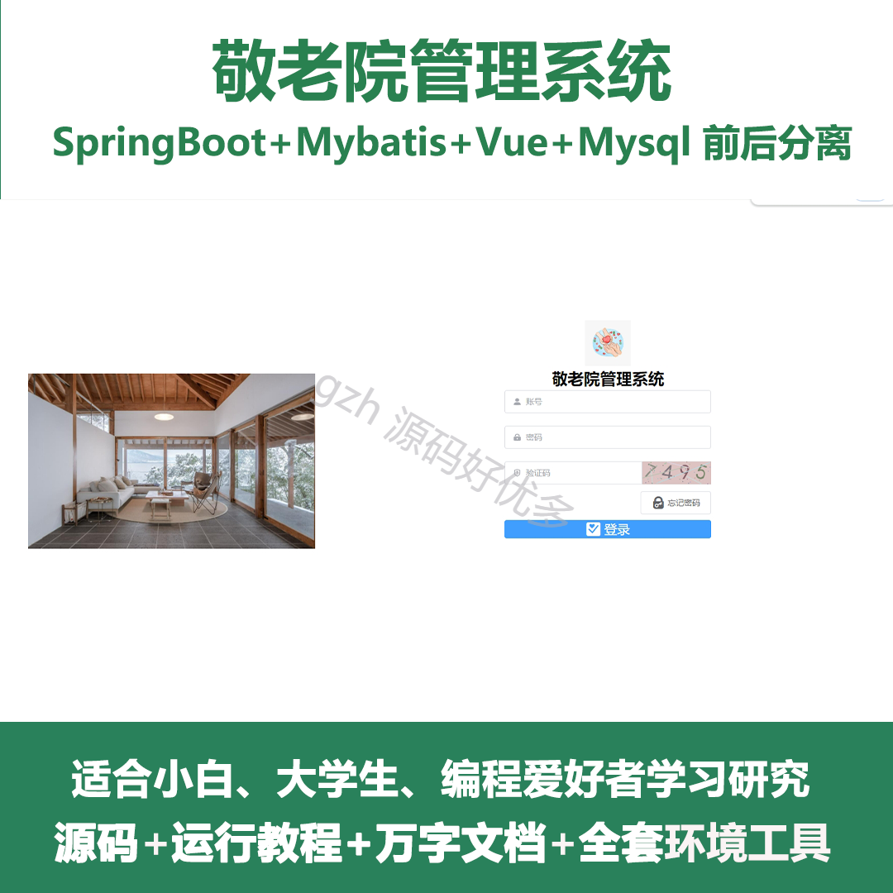
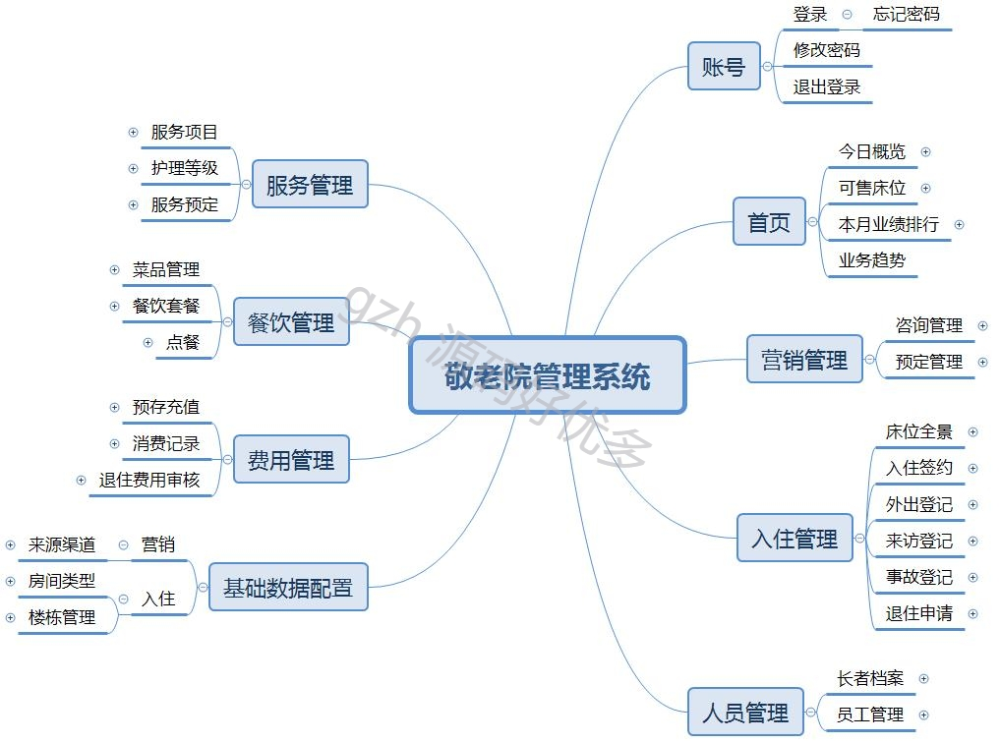
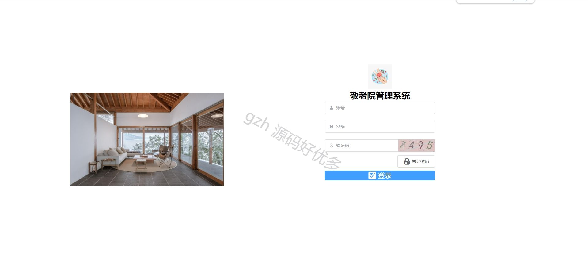
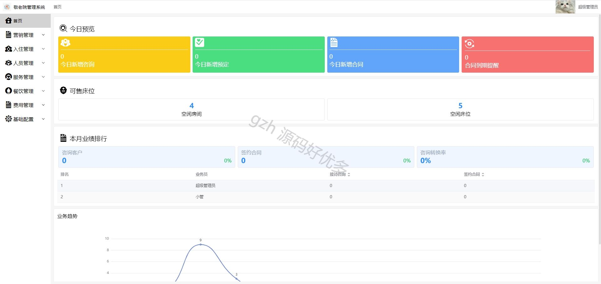
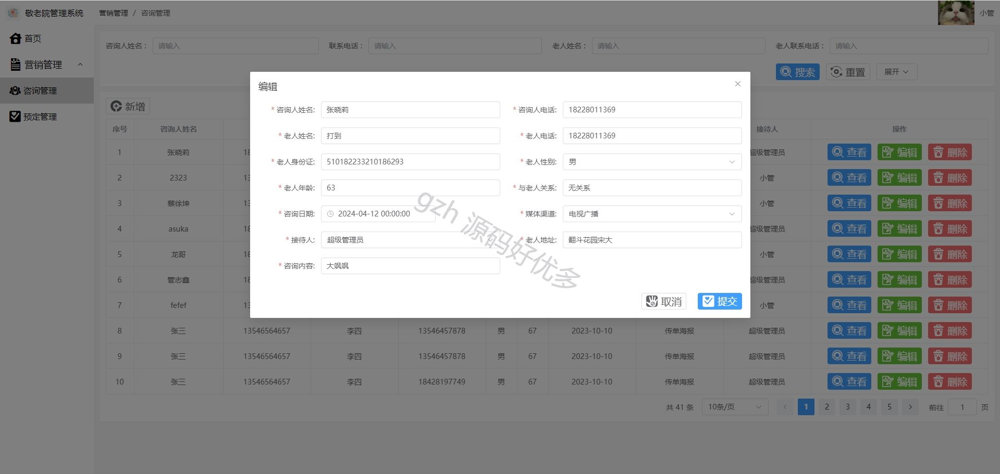
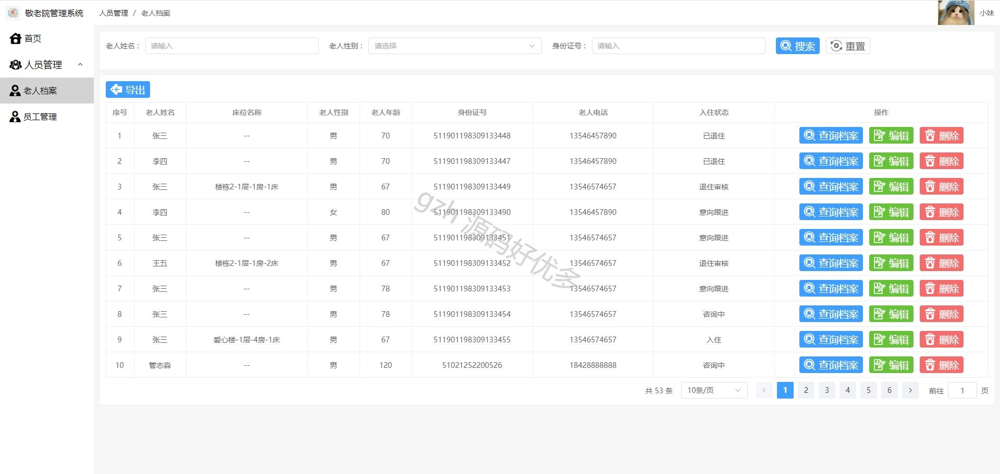
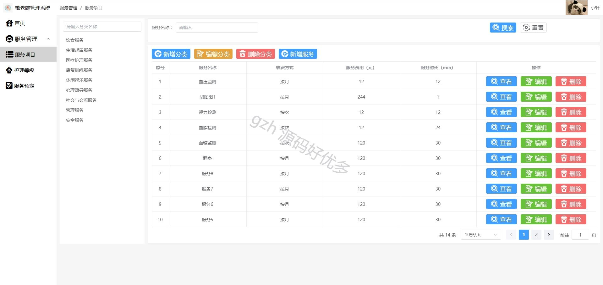
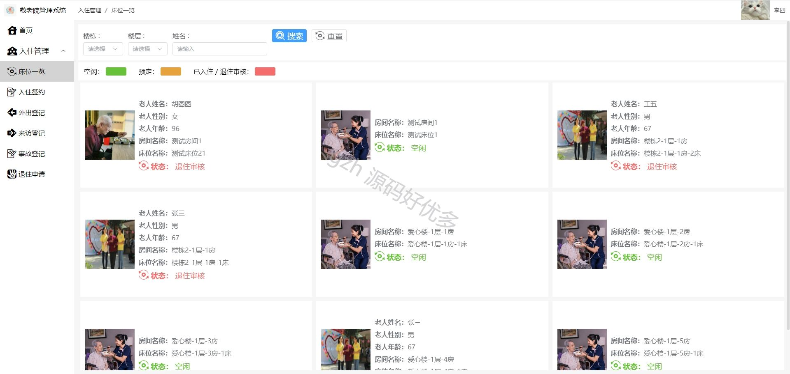
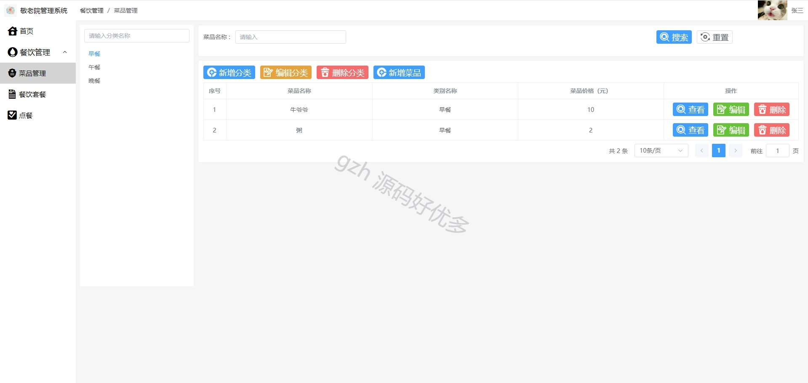
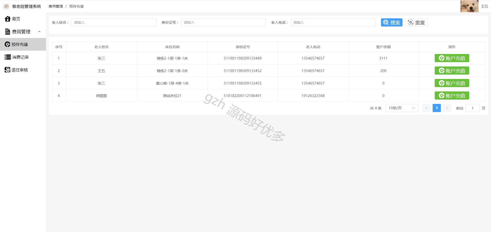
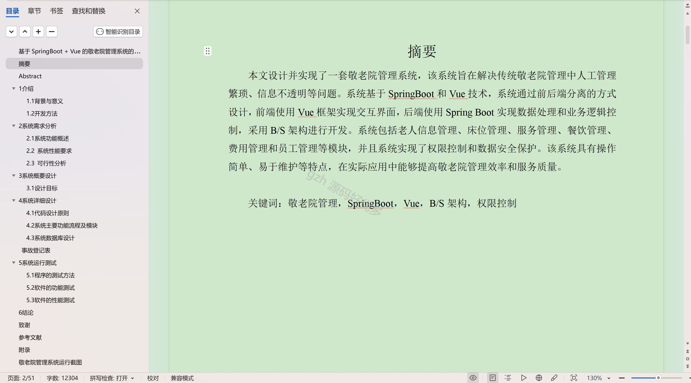
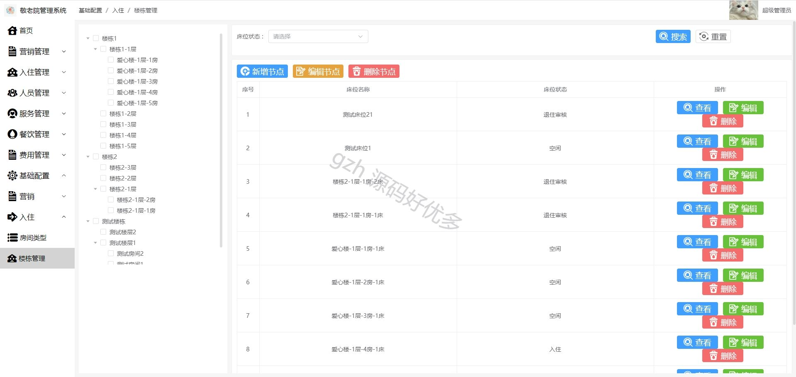

  
